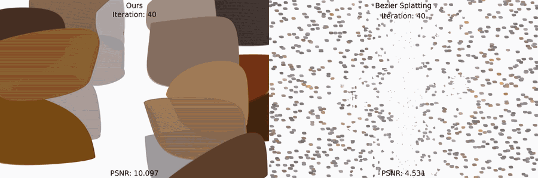
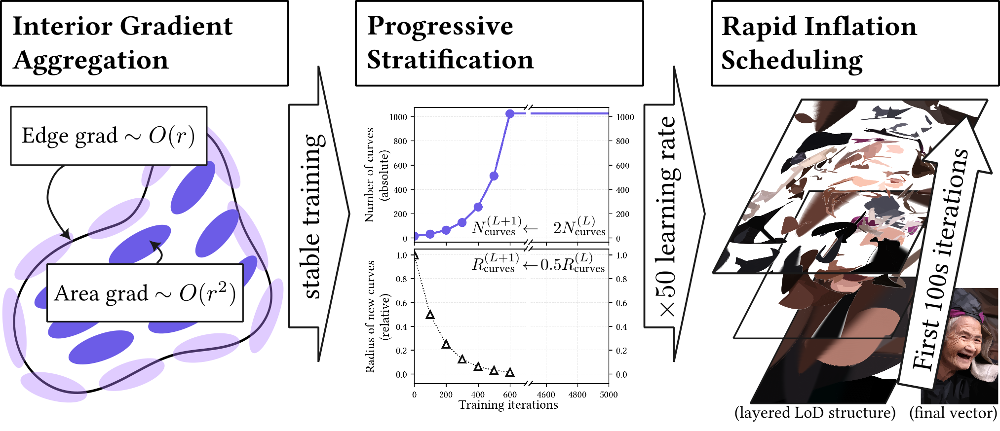
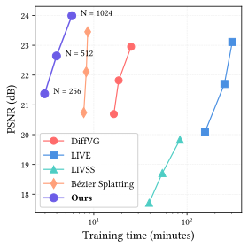

# Vector Scaffolding: Inter-Scale Orchestration for Differentiable Image Vectorization

**Jaerin Lee, Kanggeon Lee, and Kyoung Mu Lee**

[](https://arxiv.org/pdf/2605.11913)
[](https://arxiv.org/abs/2605.11913)
[](https://jaerinlee.com/research/vector-scaffolding/)

**tl;dr**: Structure-aligned optimization schedule adds 1.4 dB PSNR in x2.5 shorter training time for image vectorization.



## Method



- **Interior Gradient Aggregation** uses gradients from curve interiors as well as boundaries.
- **Progressive Stratification** adds smaller curves where reconstruction error remains, above older curves.
- **Rapid Inflation Scheduling** grows the representation early, then refines it jointly.

## Setup

Use Linux with an NVIDIA GPU, a C++ compiler, and the CUDA toolkit (`nvcc`). The tested environment uses Python 3.12, PyTorch 2.10.0, and CUDA 12.8.

Run these commands from the repository root:

```bash
conda create -n vector-scaffolding python=3.12 -y
conda activate vector-scaffolding
pip install torch==2.10.0 torchvision==0.25.0 --index-url https://download.pytorch.org/whl/cu128
pip install -r requirements.txt
git submodule update --init --recursive
BUILD_NO_CUDA=1 pip install --no-build-isolation ./gsplat
```

Install a CUDA toolkit matching your PyTorch build; see the [PyTorch installation commands](https://pytorch.org/get-started/previous-versions/).

`gsplat/` references [XingtongGe/gsplat](https://github.com/XingtongGe/gsplat) at commit `bcca3ec`, the same Git submodule commit used by [Bézier Splatting](https://github.com/xiliu8006/Bezier_splatting). All rights to that implementation remain with its upstream authors; this repository references their code through the submodule. The installation command uses runtime CUDA compilation.

## Run on Kodak or DIV2K



Download [Kodak](https://r0k.us/graphics/kodak/) or the high-resolution training images from [DIV2K](https://data.vision.ee.ethz.ch/cvl/DIV2K/). Place the RGB images anywhere; the examples use:

```text
datasets/
├── kodak/kodim01.png
└── DIV2K_train_HR/0001.png
```

Fit and evaluate one Kodak image with a nominal budget of 1,024 curves:

```bash
CUDA_VISIBLE_DEVICES=0 python train_withsvg.py \
  -i datasets/kodak/kodim01.png -o output/kodak/kodim01_1024 \
  --num_curves 16 --num_densification 6 --densify_interval 100 \
  --iterations 5000 --seed 1
```

For DIV2K, change the input and output paths:

```bash
CUDA_VISIBLE_DEVICES=0 python train_withsvg.py \
  -i datasets/DIV2K_train_HR/0001.png -o output/div2k/0001_512 \
  --num_curves 16 --num_densification 5 --densify_interval 100 \
  --iterations 5000 --seed 1
```

Each command optimizes the selected image from scratch and evaluates its reconstruction. Change `CUDA_VISIBLE_DEVICES` to select a GPU. Keep `--seed` fixed for comparisons; CUDA operations can still produce small differences between runs.

### Choose the number of curves

`--num_curves` sets the **initial** count. Progressive runs approximately double it at each growth round:

| Nominal final budget | `--num_curves` | `--num_densification` |
| --- | --- | --- |
| 256 | 16 | 4 |
| 512 | 16 | 5 |
| 1,024 | 16 | 6 |

Opacity pruning can reduce the final count. To keep **exactly N curves**, initialize N curves and disable growth, for example:

```bash
CUDA_VISIBLE_DEVICES=0 python train_withsvg.py \
  -i datasets/kodak/kodim01.png -o output/kodak/kodim01_fixed512 \
  --num_curves 512 --num_densification 0 --iterations 5000 --seed 1
```

Replace `512` with your desired count. This fixed-budget mode disables progressive stratification and differs from the paper's growth schedule.

### Test a whole folder

```bash
for image in datasets/kodak/*.png; do
  CUDA_VISIBLE_DEVICES=0 python train_withsvg.py \
    -i "$image" -o "output/kodak/$(basename "${image%.png}")_512" \
    --num_curves 16 --num_densification 5 --iterations 5000 --seed 1
done
```

For DIV2K, replace `datasets/kodak` with `datasets/DIV2K_train_HR` and `output/kodak` with `output/div2k`.

Each output directory contains `final.png`, `gaussian_model.pth.tar`, `args.yaml`, `train.txt`, and `training.npy`. The log and NumPy file report PSNR, MS-SSIM, and timing. Add `--save_imgs` to also save the evaluated fitting image. See `python train_withsvg.py --help` for all options.

## Citation

```bibtex
@inproceedings{lee2026vectorscaffolding,
  title={{Vector Scaffolding: } Inter-Scale Orchestration for Differentiable Image Vectorization},
  author={Lee, Jaerin and Lee, Kanggeon and Lee, Kyoung Mu},
  booktitle={ECCV},
  year={2026}
}
```

## Acknowledgements

Built on [Bézier Splatting](https://github.com/xiliu8006/Bezier_splatting) and [GaussianImage](https://github.com/Xinjie-Q/GaussianImage). Vector Scaffolding contributions use the [MIT license](LICENSE), copyright 2026. The original license is preserved in [LICENSE_BEZIER_SPLATTING](LICENSE_BEZIER_SPLATTING); bundled dependencies retain their own licenses.
